# Go-MLS Architecture

**Generated**: April 2026  
**Status**: Current Architecture

---

## Executive Summary

Go-MLS is a streaming media gateway that:
- Accepts input streams via **multi-protocol ingest layer** (RTMP, RTSP, SRT, HLS pull)
- **Bridges all protocols to internal RTMP backbone** for unified distribution
- Distributes to multiple outputs, recordings, and HLS viewers via workers
- Uses worker-based architecture with FFmpeg processes
- Provides HTTP API for management

---

## Component Overview

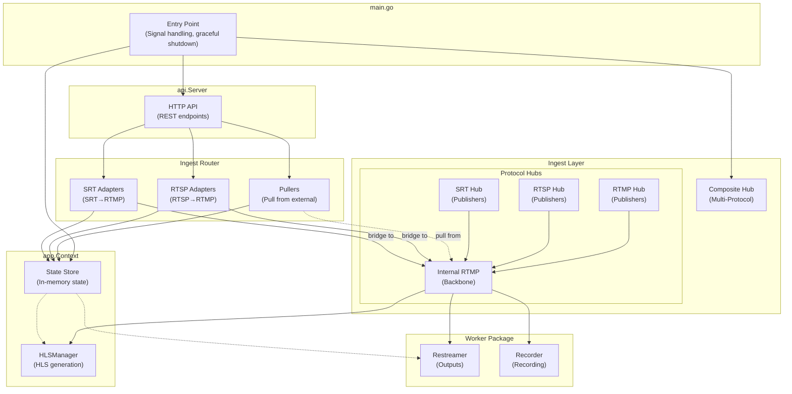

---

## Multi-Protocol Ingest Layer

Go-MLS accepts streams from multiple protocols simultaneously via a **composite hub architecture**:

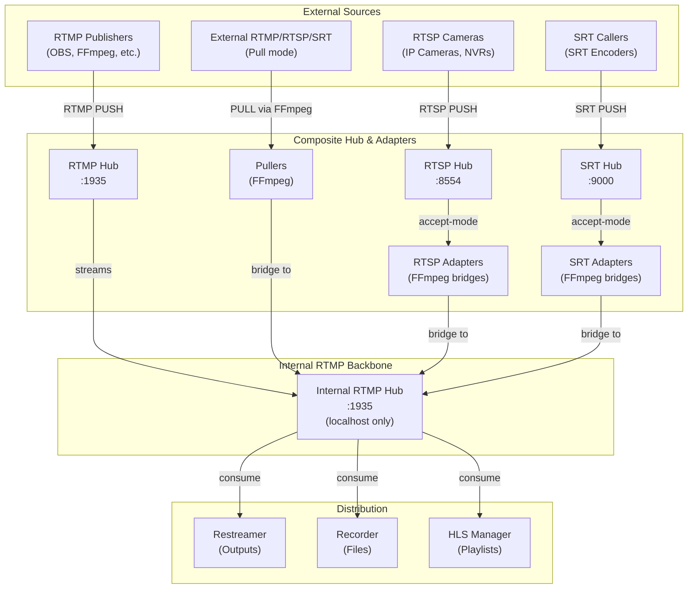

### Protocol Support

| Protocol | Role | Port | Transport |
|----------|------|------|-----------|
| **RTMP** | Publisher push (native) | 1935 | TCP, requires gortmplib |
| **RTSP** | Accept-mode push + external pull | 8554 | TCP, requires gortsplib |
| **SRT** | Accept-mode push | 9000 | UDP, requires libsrt |
| **HLS** | Pull-based ingest via FFmpeg Puller | - | HTTP |

### Hub Types Configuration

The primary hub type can be selected via `relay.hub_type` in config:

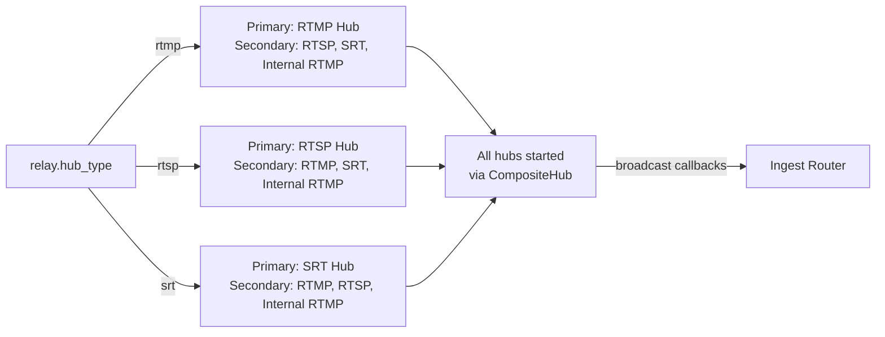

---

## Ingest Router Architecture

The Ingest Router coordinates different stream ingestion modes:

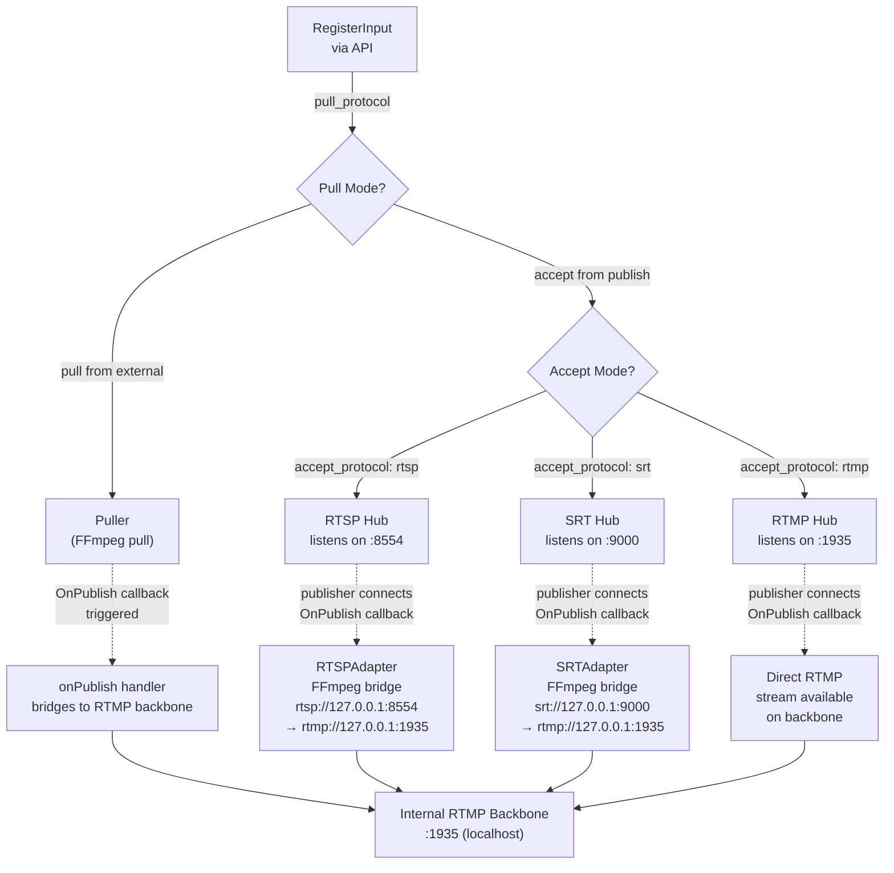

### Input Registration Details

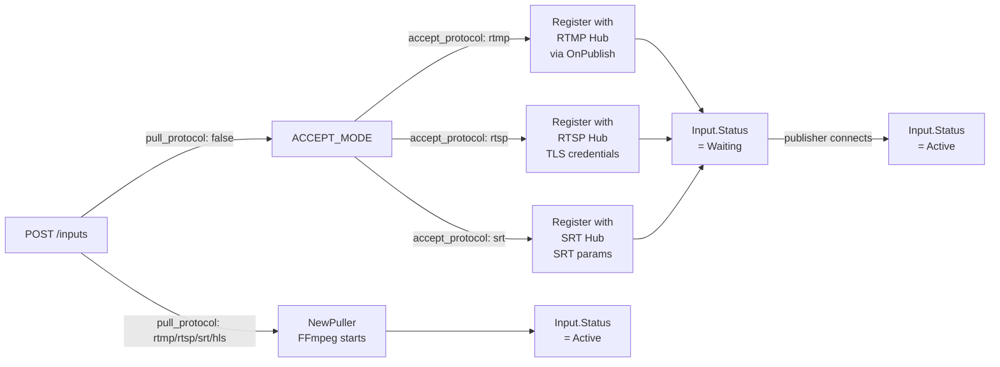

---

## Stream Flow: From Ingest to Distribution

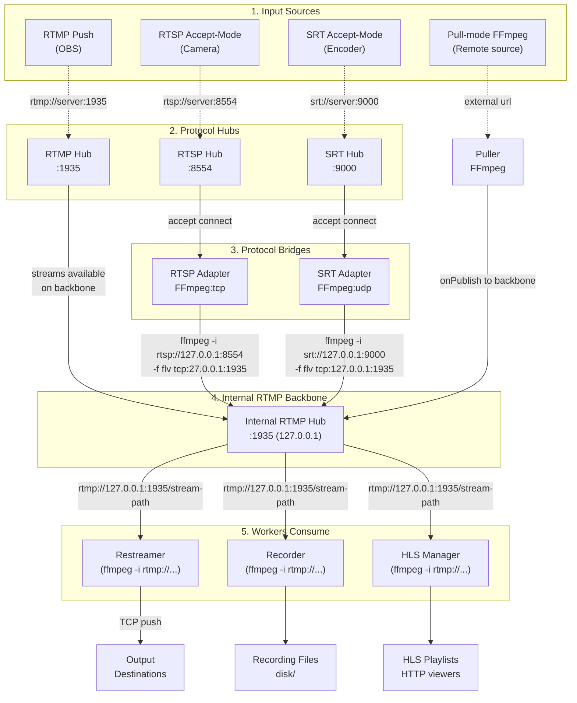

---

## Hub Architecture (Updated)

The hub is configurable via `relay.hub_type` and supports multiple simultaneous protocols:

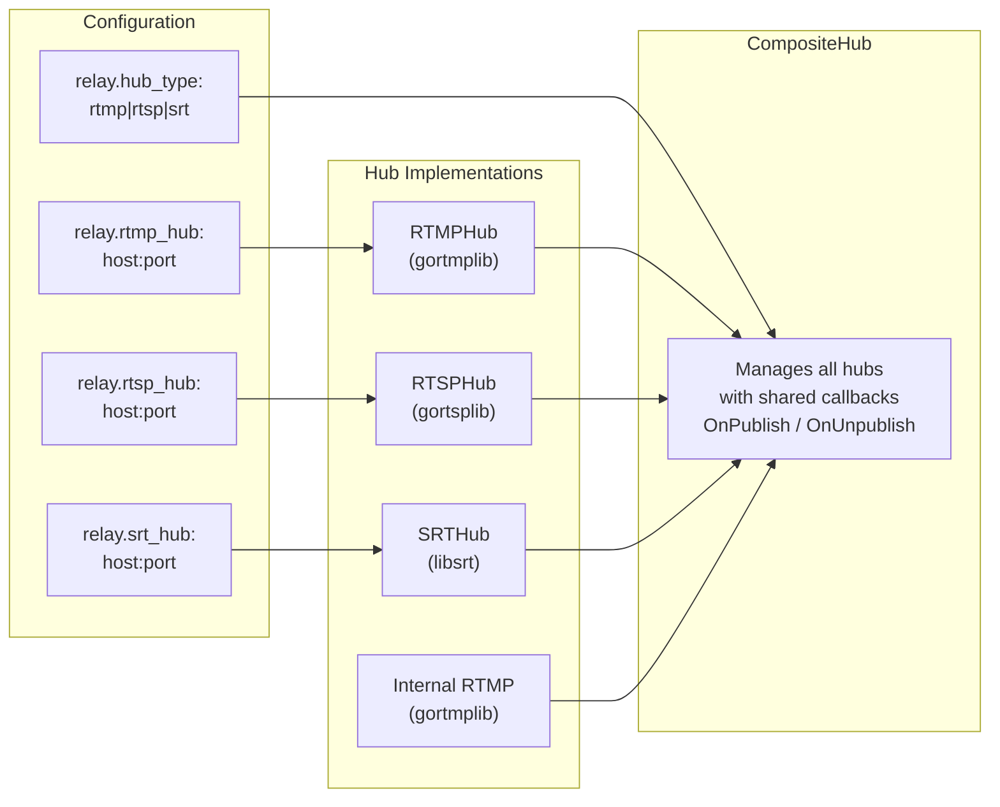

### Hub Type Primary Selection

| Config | Primary Hub | Secondary Hubs | Use Case |
|--------|-------------|----------------|----------|
| `rtmp` | RTMP Hub | RTSP, SRT, Internal | OBS/streaming software primary push |
| `rtsp` | RTSP Hub | RTMP, SRT, Internal | IP cameras primary push |
| `srt` | SRT Hub | RTMP, RTSP, Internal | SRT encoders primary push |

## Shutdown Sequence (Critical Path)

Graceful shutdown follows a strict order to ensure no goroutine leaks:

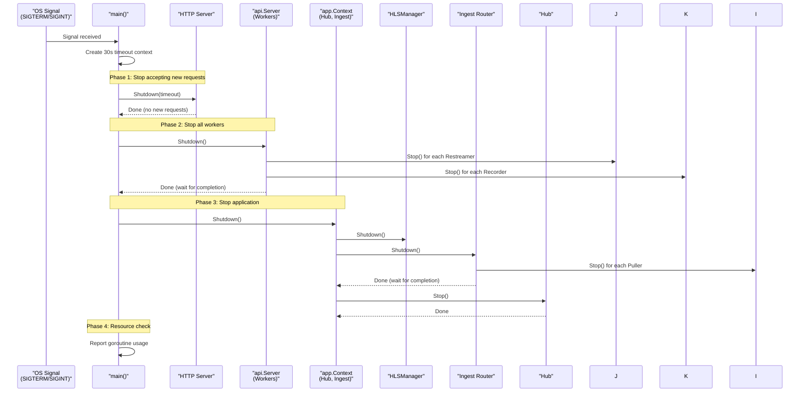

### Shutdown Guarantees

1. **HTTP Server** stops accepting new requests first
2. **Workers** (Restreamers, Recorders) are stopped and waited
3. **Pullers** are stopped and waited
4. **Hub** connections are closed
5. **Final check** reports any remaining goroutines

---

## Worker Architecture

Workers manage FFmpeg child processes with proper lifecycle management:

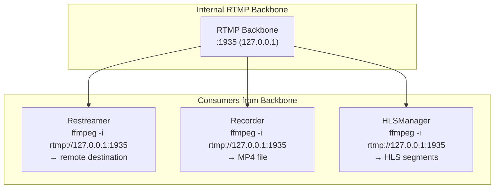

### Worker Types

| Worker | Purpose | Managed By | Input |
|--------|---------|------------|-------|
| `Puller` | Pull from remote URL (RTMP/RTSP/SRT/HLS) → push to local RTMP hub | Ingest Router | External sources |
| `RTSPAdapter` | Accept RTSP → bridge to internal RTMP backbone | Ingest Router | RTSP Hub accept-mode |
| `SRTAdapter` | Accept SRT → bridge to internal RTMP backbone | Ingest Router | SRT Hub accept-mode |
| `Restreamer` | Take from backbone → push to remote RTMP | API Server | Internal RTMP |
| `Recorder` | Take from backbone → record to MP4 | API Server | Internal RTMP |
| `HLSManager` | Take from backbone → generate HLS segments | API Server | Internal RTMP |

### Ingest Router Worker Management

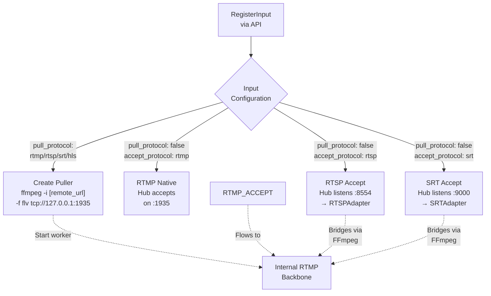

---

## Runtime Lifecycle Sequences

### Import Rebuild Sequence

The import path clears runtime state, re-registers inputs, restores output definitions,
waits for pull inputs to become active, and then starts outputs. The HTTP request returns `202 Accepted` before this rebuild finishes, so follow-up control calls can briefly overlap the async restore window.

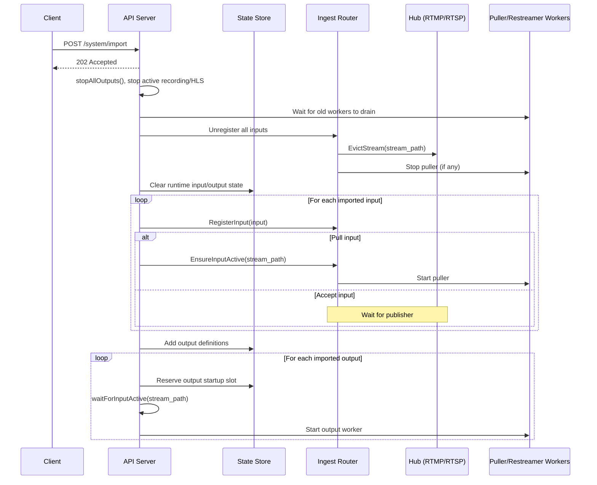

### Input Delete Cleanup Sequence

Deleting an input now performs explicit runtime teardown for outputs, recordings,
HLS generation, pullers, and hub publishers before removing state.

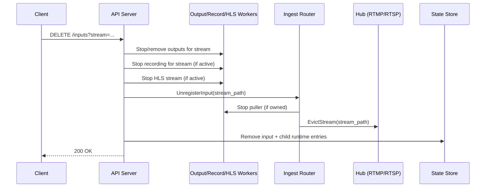

---

## State Management

### State Store Structure

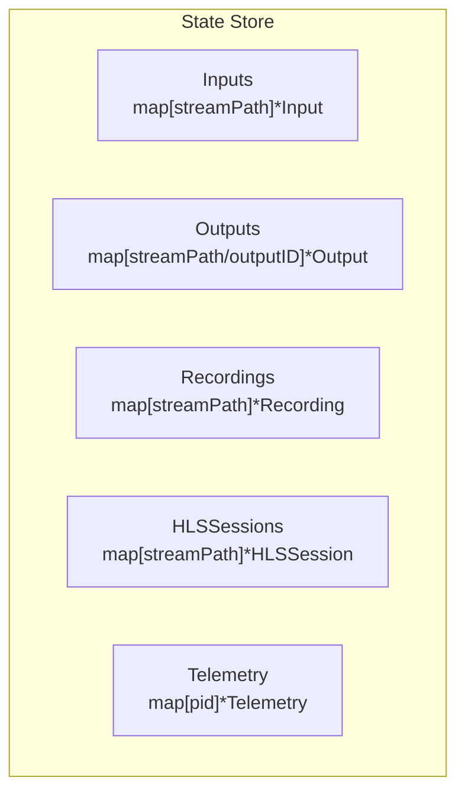

For practical read/write behavior, hot paths, and scan tradeoffs, see `docs/state-and-stats.md`.

---

## API Endpoints

| Endpoint | Methods | Description |
|----------|---------|-------------|
| `/inputs` | GET, POST, DELETE | Manage input streams |
| `/outputs` | GET, POST, DELETE | Manage output relays |
| `/outputs/start` | POST | Restart an existing output in place |
| `/outputs/stop` | POST | Stop an existing output without deleting it |
| `/record` | POST, DELETE | Start/stop recording |
| `/recordings` | GET, DELETE | List recordings from disk and delete completed files |
| `/recordings/sse` | GET | Push recording refresh notifications to the web UI |
| `/hls/start` | POST | Start HLS viewer |
| `/hls/stop` | POST | Stop HLS viewer |
| `/hls/heartbeat` | POST | Refresh HLS viewer heartbeat |
| `/stats` | GET | Get system statistics |
| `/system/export` | GET | Export configuration |
| `/system/import` | POST | Import configuration |

---

## File Structure

### internal/hub/ - Media Ingestion Hub
```
internal/hub/
├── hub.go    # Hub interface + RTMPHub
└── rtsp.go   # RTSPHub implementation
```

### internal/worker/ - FFmpeg Process Management
```
internal/worker/
├── hls.go                # HLSManager, HLSSession lifecycle
├── process_errors.go     # Worker-level process error mapping
├── puller.go             # Puller - pulls from remote, pushes to hub
├── recorder.go           # Recorder - hub to MP4
├── restreamer.go         # Restreamer - hub to remote RTMP
└── worker.go             # BaseWorker, ProcessWorker, Worker state machine
```

### internal/ingest/ - Stream Ingestion
```
internal/ingest/
└── router.go      # Smart Ingest Router (pullers + acceptors)
```

### internal/state/ - State Management
```
internal/state/
├── presets.go     # Built-in output presets and ffmpeg args
└── state.go       # Thread-safe in-memory store and state types
```

### internal/api/ - HTTP Control Plane
```
internal/api/
└── server.go     # HTTP API server with all endpoints
```

### internal/app/ - Application Context
```
internal/app/
└── context.go    # Creates hub, ingest, workers, state
```

---

## Design Principles

### 1. Interface-Based Hub
The `Hub` interface allows swapping between RTMP and RTSP protocols without changing worker code.

### 2. Worker Lifecycle
Workers follow the `Start()` → `Run()` → `Stop()` → `Wait()` pattern with proper goroutine management.

### 3. State-Based Design
Centralized state store for inputs, outputs, recordings, and HLS sessions enables persistence and export/import.

Runtime list APIs return value snapshots (not shared pointers), so read-heavy handlers like `/stats` can iterate safely while writers update status/PID fields under store locks.

The `/stats` endpoint itself is backed by a background-refreshed cache: a periodic goroutine samples self usage, reads store snapshots and telemetry, pre-encodes the JSON response, and atomically swaps the latest payload for request handlers to serve.

### 4. No Callbacks in Critical Paths
Token validation and publish handlers are synchronous to ensure correctness.

### 5. Process Group Isolation
FFmpeg processes run in their own process group to prevent SIGTERM propagation from parent.

### 6. Graceful Shutdown with Timeout
Workers receive SIGTERM first (5s timeout), then SIGKILL if needed.

Hub lifecycle (`Start()`/`Stop()`) is serialized internally to avoid concurrent lifecycle races and to support safe restart after stop.

---

## Related Documentation

- [Worker FSM Design](worker-fsm.md) - Detailed state machine diagrams
- [API Reference](api-reference.md) - HTTP endpoints
- [Configuration](configuration.md) - JSON config schema
- [State And Stats Guide](state-and-stats.md) - Data model keys, access patterns, frequencies
