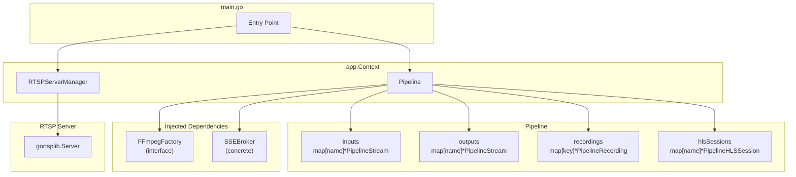
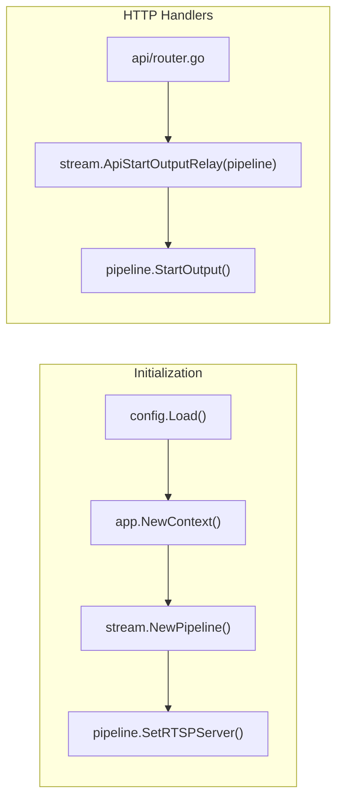
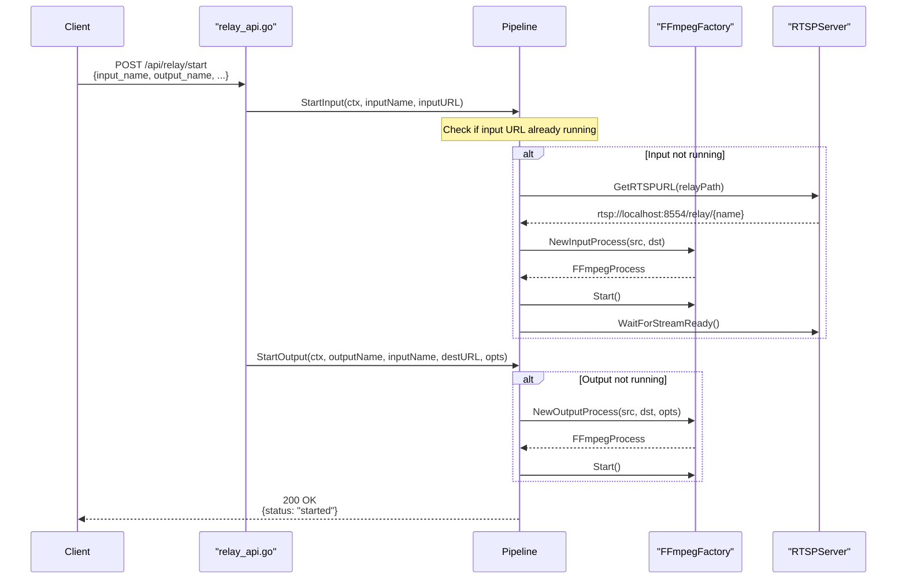
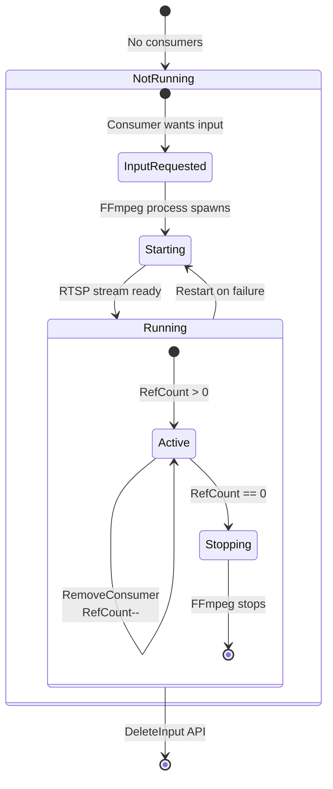
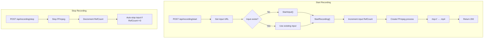
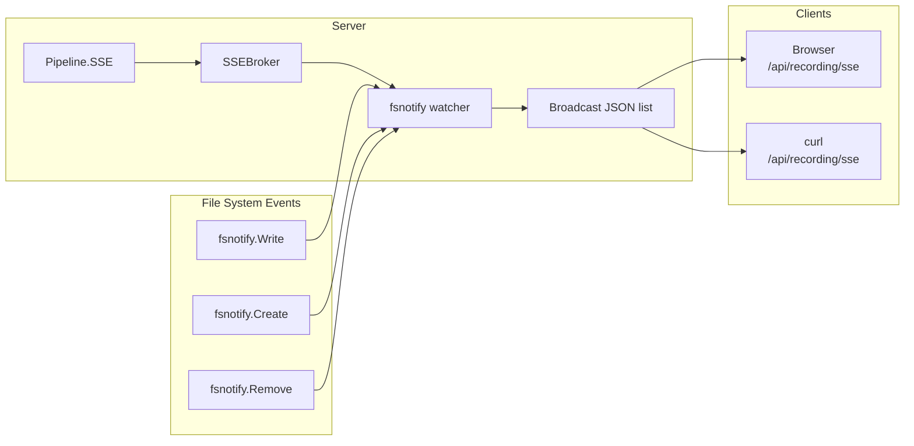
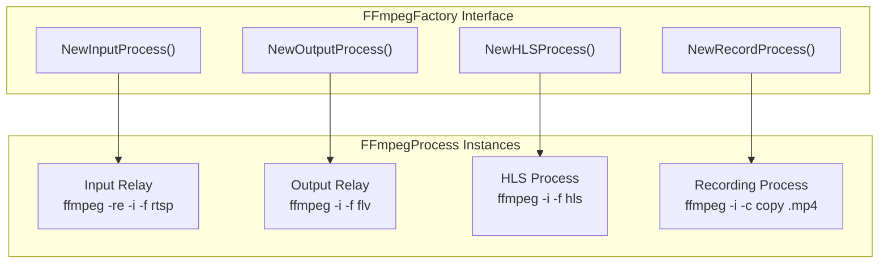
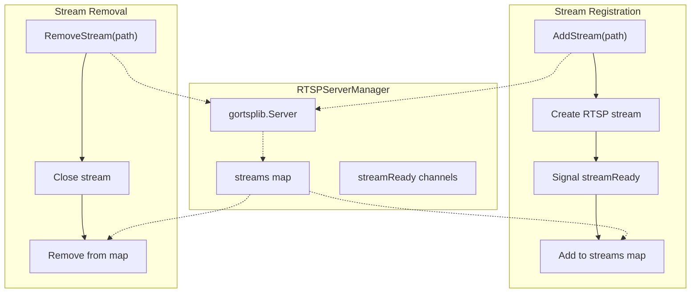
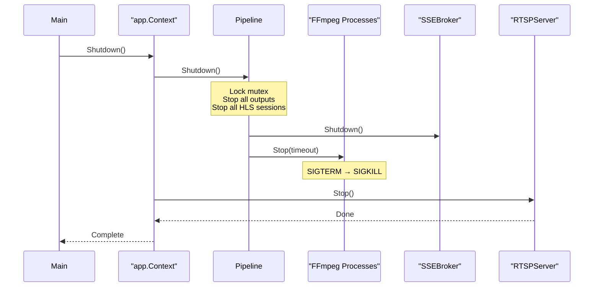

# Go-MLS Architecture

**Generated**: April 2026  
**Status**: Current Architecture

---

## Executive Summary

Go-MLS is a streaming media gateway that:
- Accepts input streams (RTSP, RTMP, HTTP, File)
- Converts them to local RTSP via FFmpeg
- Distributes to multiple outputs, recordings, and HLS viewers
- Uses reference counting to optimize resource usage

The architecture uses a single **Pipeline** struct that manages all streams with direct method calls—no interfaces, no callbacks, no global state.

---

## Component Overview



---

## Dependency Injection



---

## Start Output Relay Flow



---

## Input Lifecycle (Reference Counting)



### Refcount Operations

| Operation | RefCount Change | Trigger |
|-----------|----------------|---------|
| StartOutput | +1 | Output relay starts |
| StopOutput | -1 | Output relay stops |
| StartRecording | +1 | Recording starts |
| StopRecording | -1 | Recording stops |
| StartHLSViewer | +1 | First viewer joins |
| StopHLSViewer | -1 | Last viewer leaves |

---

## Recording Flow



---

## HLS Viewer Flow

```mermaid
flowchart TB
    subgraph session["HLS Session Lifecycle"]
        A["POST /api/relay/hls/start-viewer"] --> B{"Session exists?"}
        B -->|No| C["Create PipelineHLSSession"]
        B -->|Yes| D["Use existing session"]
        C --> E["Generate viewer_id"]
        D --> E
        E --> F["Add viewer to session"]
        F --> G["Return {viewer_id, playlist_url}"]
    end
    
    subgraph watch["Watch HLS Stream"]
        H["GET /api/relay/watch-input/hls/{name}/index.m3u8"] --> I{"Session ready?"}
        I -->|No| J["Return 503"]
        I -->|Yes| K["Serve .m3u8"]
        K --> L["Serve .ts segments"]
    end
    
    subgraph cleanup["Viewer Cleanup"]
        M["POST /api/relay/hls/stop-viewer"] --> N["Remove viewer_id"]
        N --> O{"Any viewers left?"}
        O -->|No| P["Delete HLS session"]
        O -->|Yes| Q["Keep session"]
    end
```



---

## SSE Real-Time Updates



The SSE endpoint now watches the recordings directory using `fsnotify` and sends the full list of recordings as JSON whenever files are created, modified, or deleted.

---

## FFmpeg Process Architecture



---

## RTSP Server Integration



---

## Shutdown Sequence



---

## Design Principles

### 1. Single Responsibility
The Pipeline manages all streams—inputs, outputs, recordings, HLS sessions—through a unified interface.

### 2. Dependency Injection
All dependencies (FFmpegFactory, RTSPServer) are injected via setters, enabling testing with mocks.

### 3. No Callbacks
Consumer lifecycle is managed directly via goroutines and mutexes—no interface callbacks.

### 4. No Global State
SSEBroker is stored in Pipeline, not as a global variable.

### 5. Fail-Safe Defaults
Reference counting ensures inputs are only stopped when all consumers are done.

---

## File Structure

### internal/stream/ - Streaming Backend
```
internal/stream/
├── pipeline.go         # Core Pipeline struct and methods
├── stream.go          # PipelineStream, Relay, PipelineHLSSession, PipelineRecording types
├── ffmpeg.go          # FFmpegFactory interface + default implementation
├── ffmpeg_process.go  # FFmpegProcess interface + implementation
├── rtsp_server.go     # RTSPServerManager (concrete, not interface)
├── sse.go             # SSEBroker (concrete, not interface)
├── relay_api.go       # Relay HTTP handlers
├── recording_api.go   # Recording HTTP handlers
├── hls_api.go        # HLS HTTP handlers
├── preset_helper.go   # ApplyPresetAndOptions()
└── presets.go        # Platform presets (YouTube, Facebook, etc.)
```

### internal/state/ - State Management
```
internal/state/
└── state.go          # Thread-safe in-memory store for persistence
```

### internal/worker/ - FFmpeg Process Management
```
internal/worker/
├── ffmpeg.go       # RunAndMonitorFFmpeg (core wrapper)
├── puller.go       # Puller - pulls from remote, pushes to local RTMP
├── restreamer.go   # Restreamer - pushes local to remote RTMP
├── recorder.go     # Recorder - records to MP4
└── hls.go         # HLSManager - generates HLS
```

### internal/ingest/ - Stream Ingestion
```
internal/ingest/
└── router.go      # Smart Ingest Router - manages pullers, acceptors, tokens
```

### internal/api/ - HTTP Control Plane
```
internal/api/
└── server.go      # HTTP API server with all REST endpoints
```

---

## Worker Architecture

Workers manage FFmpeg child processes with telemetry:

```
┌─────────────────────────────────────────────────────────────┐
│                      worker.Puller                            │
│  FFmpeg: -re -i <remote_url> -c copy -f flv <local_rtmp>   │
│  Pulls from RTSP/SRT/HLS → Pushes to local RTMP hub         │
└─────────────────────────────────────────────────────────────┘
                              ↓
                    rtmp://127.0.0.1:1935/{streamPath}
                              ↓
┌──────────────┬──────────────┬──────────────┐
│ worker.       │ worker.      │ worker.       │
│ Restreamer   │ Recorder     │ HLSManager   │
│              │              │              │
│ -f flv       │ -c copy      │ -f hls       │
│ <remote_url> │ <file>.mp4   │ <dir>/       │
└──────────────┴──────────────┴──────────────┘
```

---

## Related Documentation

- [API Reference](api-reference.md) - Method signatures and HTTP endpoints
- [Configuration](configuration.md) - JSON config schema
