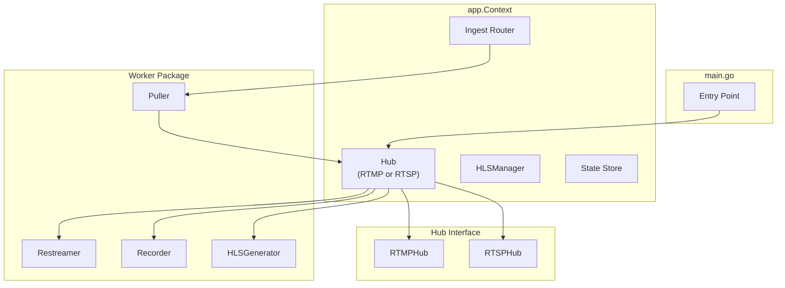
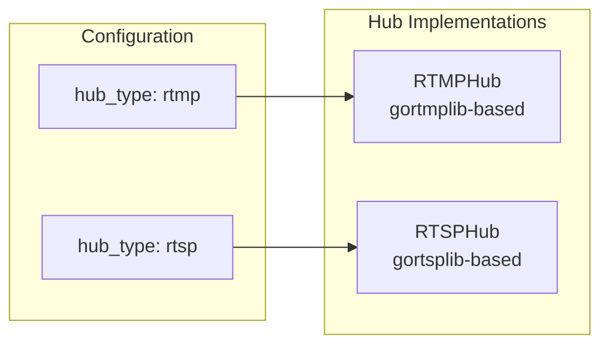
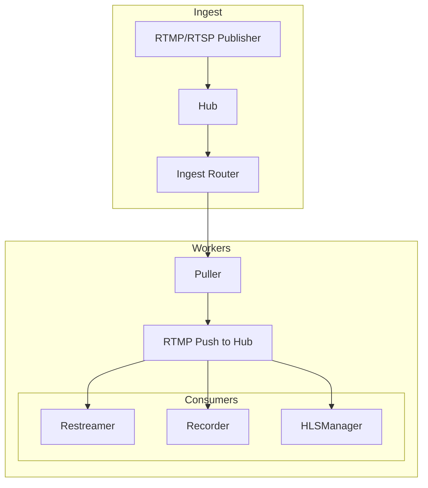
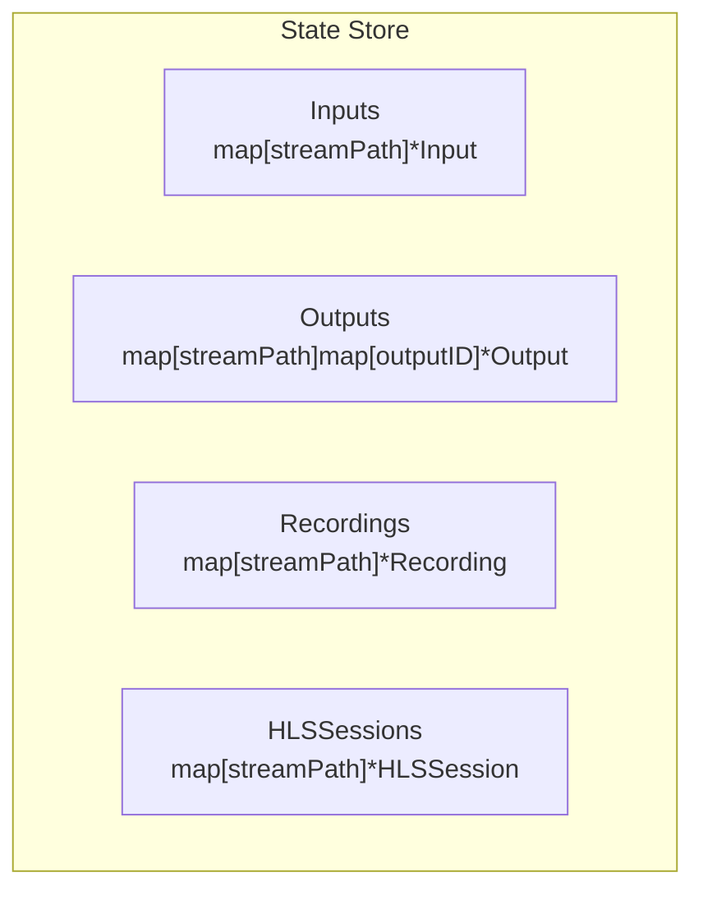
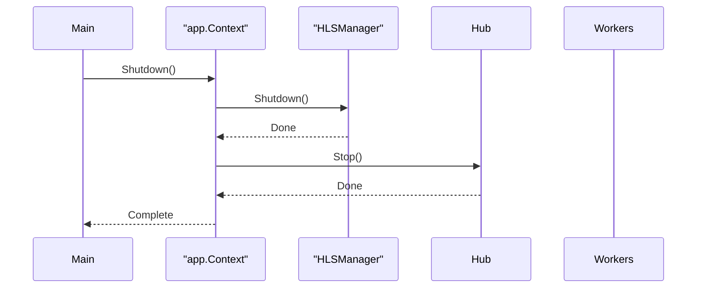

# Go-MLS Architecture

**Generated**: April 2026  
**Status**: Current Architecture

---

## Executive Summary

Go-MLS is a streaming media gateway that:
- Accepts input streams via configurable hub (RTMP or RTSP)
- Distributes to multiple outputs, recordings, and HLS viewers
- Uses worker-based architecture with FFmpeg processes

---

## Component Overview



---

## Hub Architecture

The hub is configurable via `relay.hub_type`:

| Hub Type | Protocol | Use Case |
|----------|----------|----------|
| `rtmp` | RTMP | OBS, streaming software |
| `rtsp` | RTSP | IP cameras, NVRs |



---

## Worker Architecture

Workers manage FFmpeg child processes:



### Worker Types

| Worker | Purpose | Output |
|--------|---------|--------|
| `Puller` | Pull from remote → push to local RTMP hub | `rtmp://localhost:1935/{stream}` |
| `Restreamer` | Take from hub → push to remote RTMP | RTMP destinations |
| `Recorder` | Take from hub → record to MP4 | `.mp4` files |
| `HLSManager` | Take from hub → generate HLS | `.m3u8` + `.ts` |

---

## State Management



---

## API Endpoints

| Endpoint | Methods | Description |
|----------|---------|-------------|
| `/inputs` | GET, POST, DELETE | Manage input streams |
| `/outputs` | GET, POST, DELETE | Manage output relays |
| `/record` | POST, DELETE | Start/stop recording |
| `/hls/start` | POST | Start HLS viewer |
| `/hls/stop` | POST | Stop HLS viewer |
| `/stats` | GET | Get system statistics |
| `/system/export` | GET | Export configuration |
| `/system/import` | POST | Import configuration |

---

## Shutdown Sequence



---

## File Structure

### internal/hub/ - Media Ingestion Hub
```
internal/hub/
├── hub.go    # Hub interface + RTMPHub
└── rtsp.go   # RTSPHub implementation
```

### internal/worker/ - FFmpeg Process Management
```
internal/worker/
├── ffmpeg.go       # RunAndMonitorFFmpeg (core wrapper)
├── ffmpeg_factory.go # Process interface
├── worker.go       # BaseWorker, ProcessWorker, WorkerState
├── puller.go       # Puller - pulls from remote, pushes to hub
├── restreamer.go   # Restreamer - hub to remote RTMP
├── recorder.go     # Recorder - hub to MP4
└── hls.go         # HLSManager - hub to HLS
```

### internal/ingest/ - Stream Ingestion
```
internal/ingest/
└── router.go      # Smart Ingest Router
```

### internal/state/ - State Management
```
internal/state/
└── state.go      # Thread-safe in-memory store
```

### internal/api/ - HTTP Control Plane
```
internal/api/
└── server.go      # HTTP API server
```

### internal/app/ - Application Context
```
internal/app/
└── context.go     # Creates hub, ingest, workers, state
```

---

## Design Principles

### 1. Interface-Based Hub
The `Hub` interface allows swapping between RTMP and RTSP protocols without changing worker code.

### 2. Worker Lifecycle
Workers follow the `Start()` → `Run()` → `Stop()` → `Wait()` pattern with proper goroutine management.

### 3. State-Based Design
Centralized state store for inputs, outputs, recordings, and HLS sessions enables persistence and export/import.

### 4. No Callbacks in Critical Paths
Token validation and publish handlers are synchronous to ensure correctness.

---

## Related Documentation

- [API Reference](api-reference.md) - HTTP endpoints
- [Configuration](configuration.md) - JSON config schema
