# Go-MLS Call Flows and Operational Diagrams

This document provides detailed call flows and diagrams showing how Go-MLS operates internally.

---

## 1. System Startup Flow

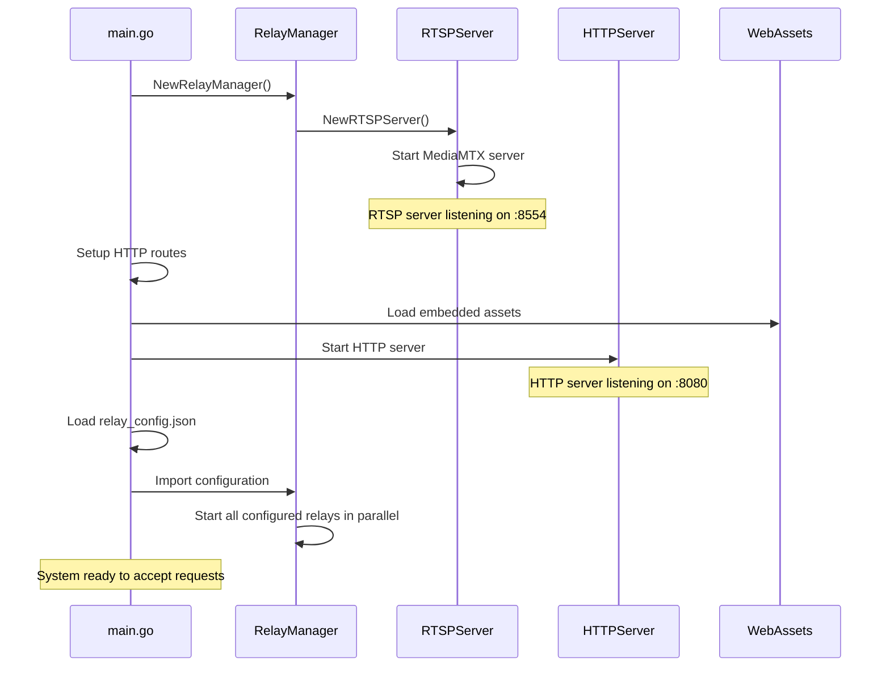
```mermaid
sequenceDiagram
    participant Main as main.go
    participant RM as RelayManager
    participant RS as RTSPServer
    participant HTTP as HTTPServer
    participant Web as WebAssets

    Main->>RM: NewRelayManager()
    RM->>RS: NewRTSPServer()
    RS->>RS: Start MediaMTX server
    Note over RS: RTSP server listening on :8554
    
    Main->>Main: Setup HTTP routes
    Main->>Web: Load embedded assets
    Main->>HTTP: Start HTTP server
    Note over HTTP: HTTP server listening on :8080
    
    Main->>Main: Load relay_config.json
    Main->>RM: Import configuration
    RM->>RM: Start all configured relays in parallel
    
    Note over Main: System ready to accept requests
```

---

## 2. Start Relay Flow

### 2.1 Complete Start Relay Sequence

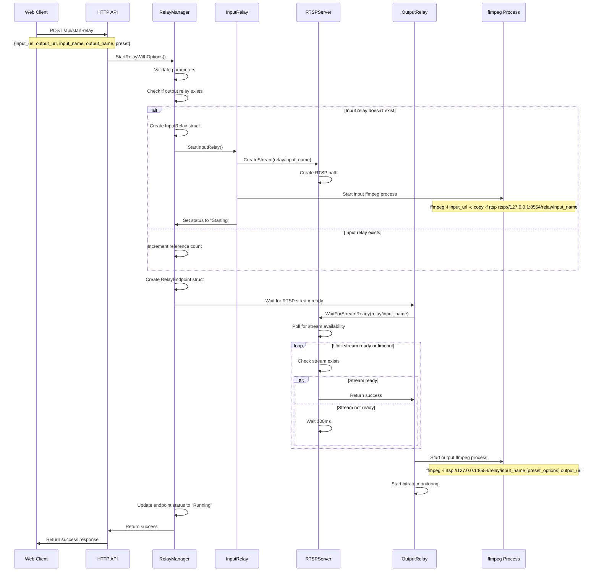
```mermaid
sequenceDiagram
    participant Client as Web Client
    participant API as HTTP API
    participant RM as RelayManager
    participant IR as InputRelay
    participant RS as RTSPServer
    participant OR as OutputRelay
    participant FFmpeg as ffmpeg Process

    Client->>API: POST /api/start-relay
    Note over Client,API: {input_url, output_url, input_name, output_name, preset}
    
    API->>RM: StartRelayWithOptions()
    RM->>RM: Validate parameters
    RM->>RM: Check if output relay exists
    
    alt Input relay doesn't exist
        RM->>RM: Create InputRelay struct
        RM->>IR: StartInputRelay()
        IR->>RS: CreateStream(relay/input_name)
        RS->>RS: Create RTSP path
        IR->>FFmpeg: Start input ffmpeg process
        Note over FFmpeg: ffmpeg -i input_url -c copy -f rtsp rtsp://127.0.0.1:8554/relay/input_name
        IR->>RM: Set status to "Starting"
    else Input relay exists
        RM->>RM: Increment reference count
    end
    
    RM->>RM: Create RelayEndpoint struct
    RM->>OR: Wait for RTSP stream ready
    OR->>RS: WaitForStreamReady(relay/input_name)
    RS->>RS: Poll for stream availability
    
    loop Until stream ready or timeout
        RS->>RS: Check stream exists
        alt Stream ready
            RS->>OR: Return success
        else Stream not ready
            RS->>RS: Wait 100ms
        end
    end
    
    OR->>FFmpeg: Start output ffmpeg process
    Note over FFmpeg: ffmpeg -i rtsp://127.0.0.1:8554/relay/input_name [preset_options] output_url
    OR->>OR: Start bitrate monitoring
    RM->>RM: Update endpoint status to "Running"
    
    RM->>API: Return success
    API->>Client: Return success response
```

### 2.2 Input Relay State Management

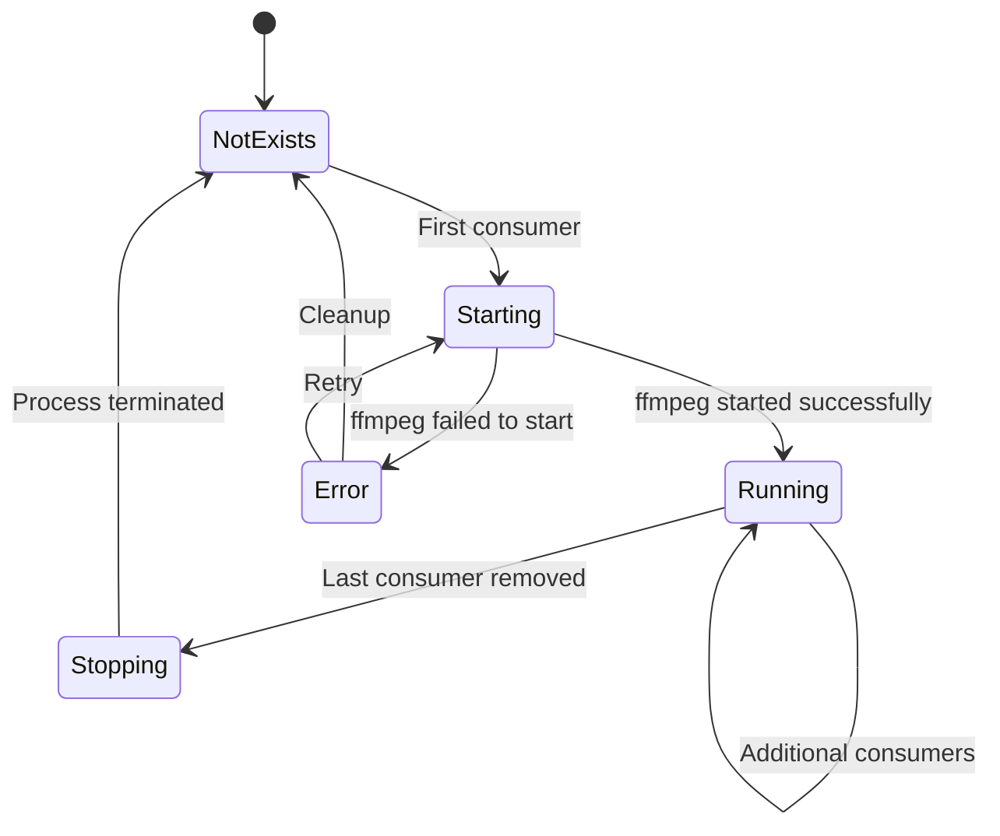
```mermaid
stateDiagram-v2
    [*] --> NotExists
    NotExists --> Starting : First consumer
    Starting --> Running : ffmpeg started successfully
    Starting --> Error : ffmpeg failed to start
    Running --> Running : Additional consumers
    Running --> Stopping : Last consumer removed
    Stopping --> NotExists : Process terminated
    Error --> NotExists : Cleanup
    Error --> Starting : Retry
```

### 2.3 Output Relay State Management

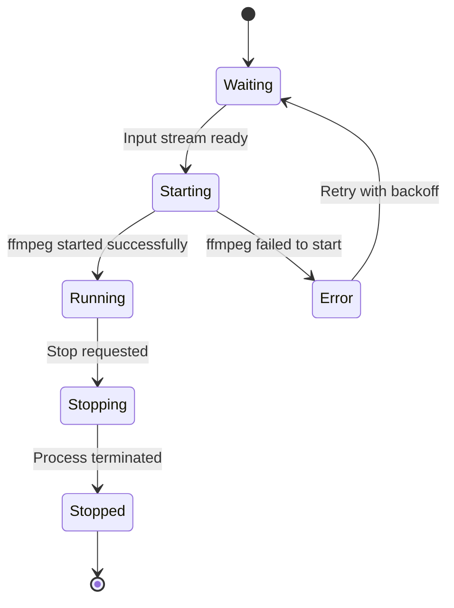
```mermaid
stateDiagram-v2
    [*] --> Waiting
    Waiting --> Starting : Input stream ready
    Starting --> Running : ffmpeg started successfully
    Starting --> Error : ffmpeg failed to start
    Running --> Stopping : Stop requested
    Stopping --> Stopped : Process terminated
    Error --> Waiting : Retry with backoff
    Stopped --> [*]
```

---

## 3. Recording Flow

### 3.1 Start Recording Sequence

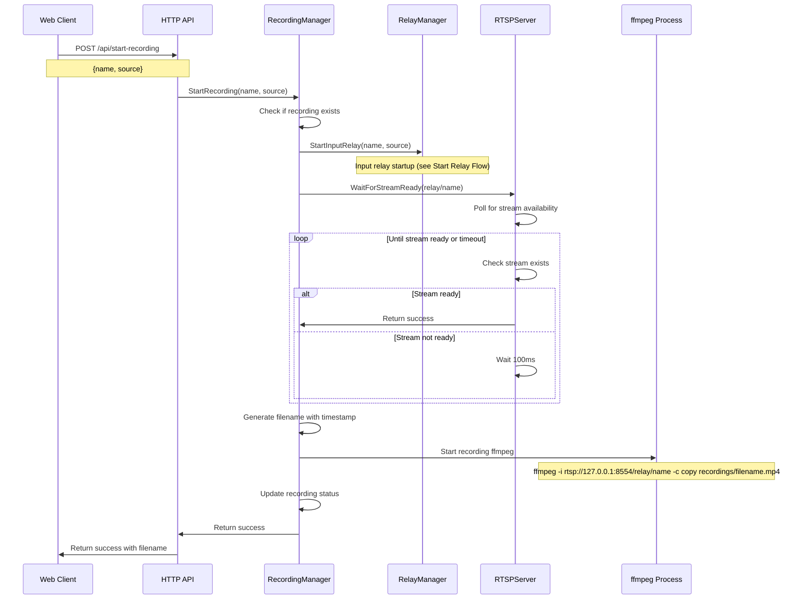
```mermaid
sequenceDiagram
    participant Client as Web Client
    participant API as HTTP API
    participant RecM as RecordingManager
    participant RM as RelayManager
    participant RS as RTSPServer
    participant FFmpeg as ffmpeg Process

    Client->>API: POST /api/start-recording
    Note over Client,API: {name, source}
    
    API->>RecM: StartRecording(name, source)
    RecM->>RecM: Check if recording exists
    RecM->>RM: StartInputRelay(name, source)
    
    Note over RM: Input relay startup (see Start Relay Flow)
    
    RecM->>RS: WaitForStreamReady(relay/name)
    RS->>RS: Poll for stream availability
    
    loop Until stream ready or timeout
        RS->>RS: Check stream exists
        alt Stream ready
            RS->>RecM: Return success
        else Stream not ready
            RS->>RS: Wait 100ms
        end
    end
    
    RecM->>RecM: Generate filename with timestamp
    RecM->>FFmpeg: Start recording ffmpeg
    Note over FFmpeg: ffmpeg -i rtsp://127.0.0.1:8554/relay/name -c copy recordings/filename.mp4
    
    RecM->>RecM: Update recording status
    RecM->>API: Return success
    API->>Client: Return success with filename
```

### 3.2 Recording File Management

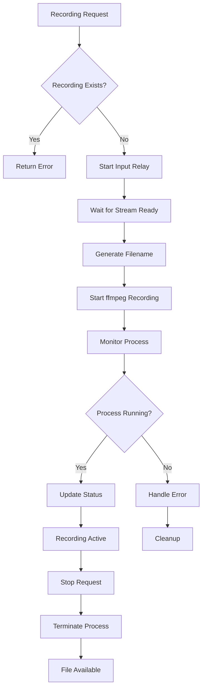
```mermaid
flowchart TD
    A[Recording Request] --> B{Recording Exists?}
    B -->|Yes| C[Return Error]
    B -->|No| D[Start Input Relay]
    D --> E[Wait for Stream Ready]
    E --> F[Generate Filename]
    F --> G[Start ffmpeg Recording]
    G --> H[Monitor Process]
    H --> I{Process Running?}
    I -->|Yes| J[Update Status]
    I -->|No| K[Handle Error]
    J --> L[Recording Active]
    K --> M[Cleanup]
    L --> N[Stop Request]
    N --> O[Terminate Process]
    O --> P[File Available]
```

---

## 4. Configuration Management Flow

### 4.1 Export Configuration

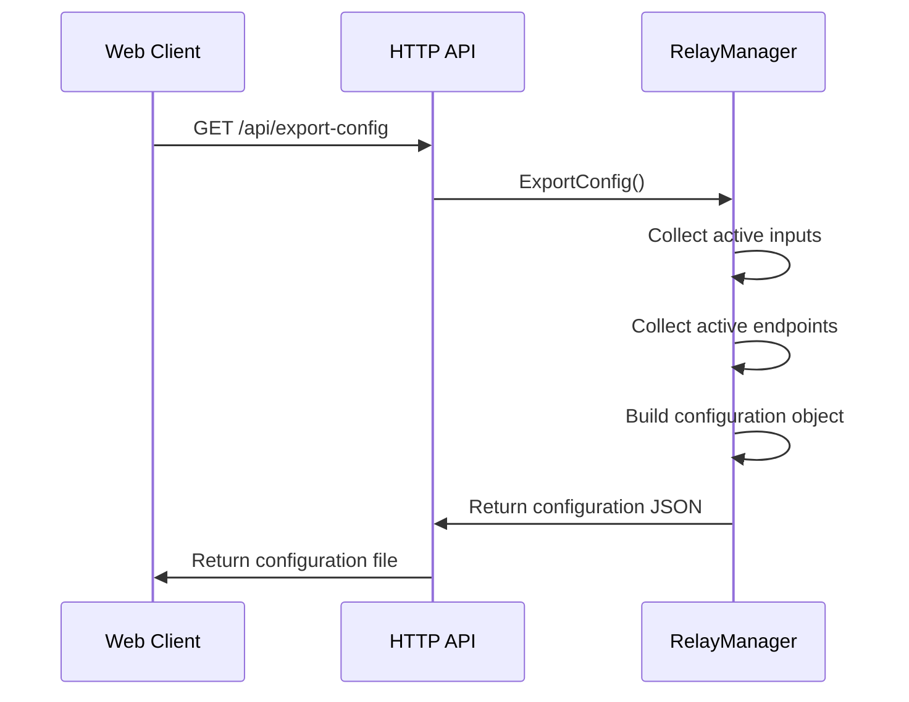
```mermaid
sequenceDiagram
    participant Client as Web Client
    participant API as HTTP API
    participant RM as RelayManager

    Client->>API: GET /api/export-config
    API->>RM: ExportConfig()
    RM->>RM: Collect active inputs
    RM->>RM: Collect active endpoints
    RM->>RM: Build configuration object
    RM->>API: Return configuration JSON
    API->>Client: Return configuration file
```

### 4.2 Import Configuration

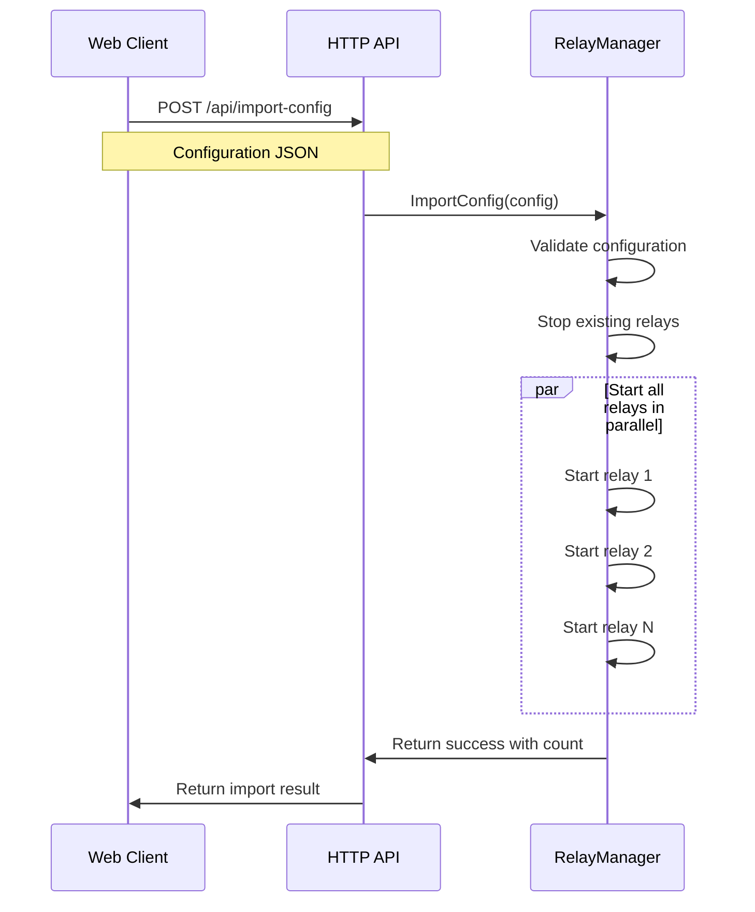
```mermaid
sequenceDiagram
    participant Client as Web Client
    participant API as HTTP API
    participant RM as RelayManager

    Client->>API: POST /api/import-config
    Note over Client,API: Configuration JSON
    
    API->>RM: ImportConfig(config)
    RM->>RM: Validate configuration
    RM->>RM: Stop existing relays
    
    par Start all relays in parallel
        RM->>RM: Start relay 1
        RM->>RM: Start relay 2
        RM->>RM: Start relay N
    end
    
    RM->>API: Return success with count
    API->>Client: Return import result
```

---

## 5. Stream Synchronization

### 5.1 Reference Counting Mechanism

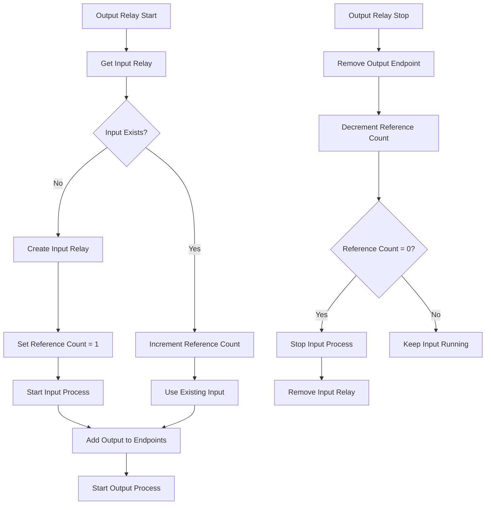
```mermaid
flowchart TD
    A[Output Relay Start] --> B[Get Input Relay]
    B --> C{Input Exists?}
    C -->|No| D[Create Input Relay]
    C -->|Yes| E[Increment Reference Count]
    D --> F[Set Reference Count = 1]
    F --> G[Start Input Process]
    E --> H[Use Existing Input]
    G --> I[Add Output to Endpoints]
    H --> I
    I --> J[Start Output Process]
    
    K[Output Relay Stop] --> L[Remove Output Endpoint]
    L --> M[Decrement Reference Count]
    M --> N{Reference Count = 0?}
    N -->|Yes| O[Stop Input Process]
    N -->|No| P[Keep Input Running]
    O --> Q[Remove Input Relay]
```

### 5.2 Stream Readiness Detection

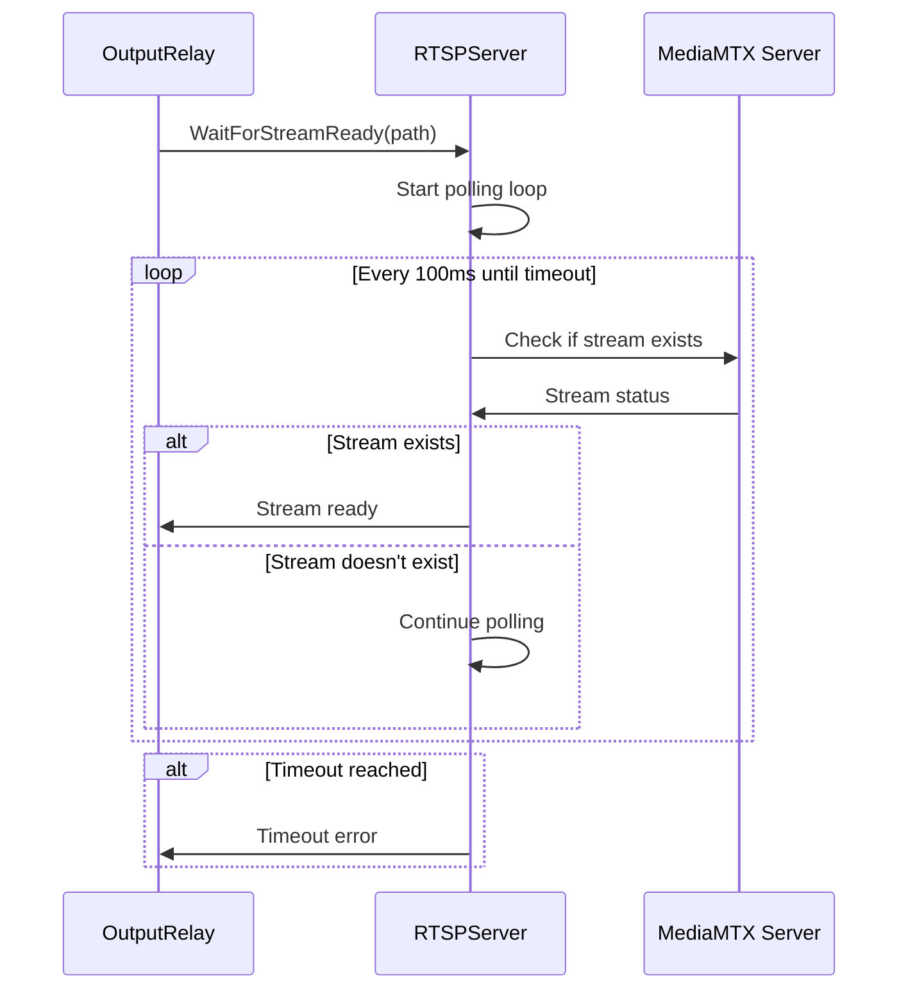
```mermaid
sequenceDiagram
    participant OR as OutputRelay
    participant RS as RTSPServer
    participant MediaMTX as MediaMTX Server

    OR->>RS: WaitForStreamReady(path)
    RS->>RS: Start polling loop
    
    loop Every 100ms until timeout
        RS->>MediaMTX: Check if stream exists
        MediaMTX->>RS: Stream status
        alt Stream exists
            RS->>OR: Stream ready
        else Stream doesn't exist
            RS->>RS: Continue polling
        end
    end
    
    alt Timeout reached
        RS->>OR: Timeout error
    end
```

---

## 6. Bitrate Monitoring Flow

### 6.1 Real-time Bitrate Collection

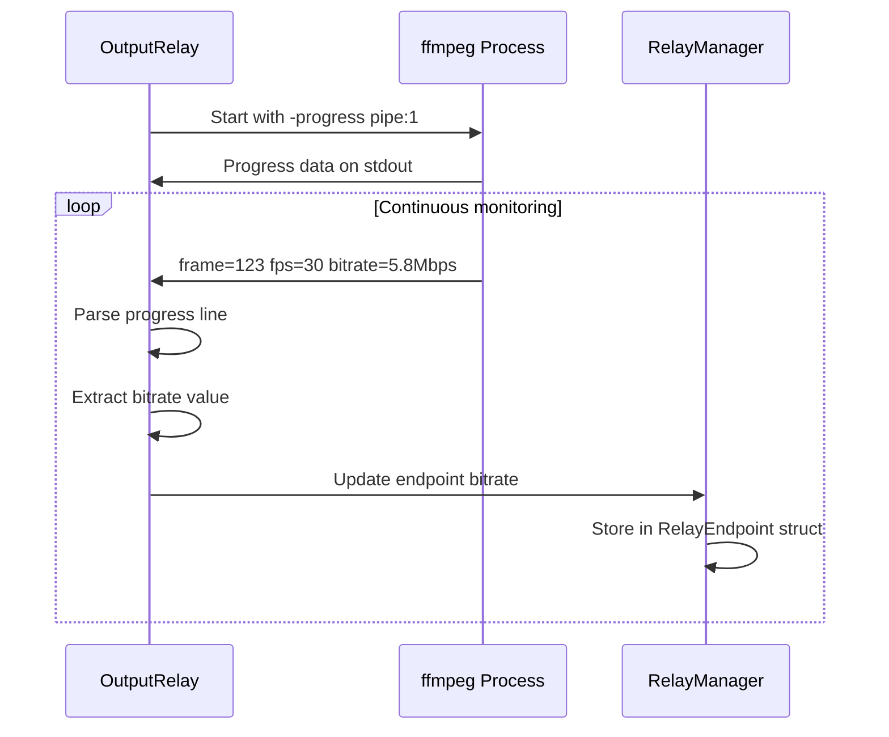
```mermaid
sequenceDiagram
    participant OR as OutputRelay
    participant FFmpeg as ffmpeg Process
    participant RM as RelayManager

    OR->>FFmpeg: Start with -progress pipe:1
    FFmpeg->>OR: Progress data on stdout
    
    loop Continuous monitoring
        FFmpeg->>OR: frame=123 fps=30 bitrate=5.8Mbps
        OR->>OR: Parse progress line
        OR->>OR: Extract bitrate value
        OR->>RM: Update endpoint bitrate
        RM->>RM: Store in RelayEndpoint struct
    end
```

### 6.2 Status Reporting

```mermaid
flowchart TD
    A[Client Requests Status] --> B[API /status endpoint]
    B --> C[RelayManager.GetStatus()]
    C --> D[Collect Input Status]
    C --> E[Collect Endpoint Status]
    C --> F[Collect Recording Status]
    D --> G[Include reference counts]
    E --> H[Include bitrate data]
    F --> I[Include recording info]
    G --> J[Build JSON response]
    H --> J
    I --> J
    J --> K[Return to Client]
```

---

## 7. Error Handling and Recovery

### 7.1 Process Failure Recovery

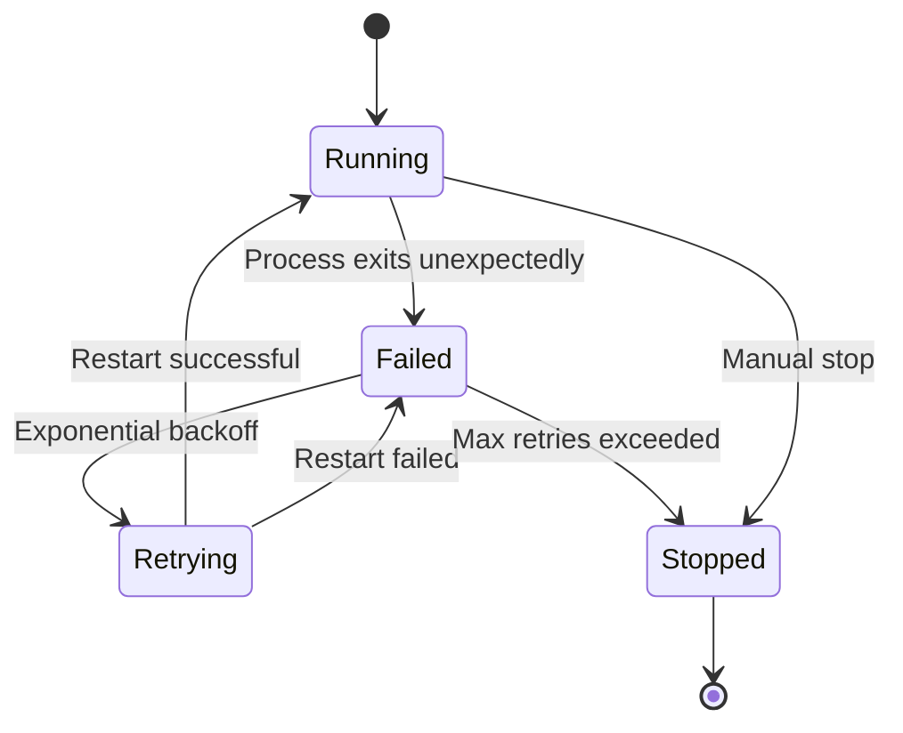
```mermaid
stateDiagram-v2
    [*] --> Running
    Running --> Failed : Process exits unexpectedly
    Failed --> Retrying : Exponential backoff
    Retrying --> Running : Restart successful
    Retrying --> Failed : Restart failed
    Failed --> Stopped : Max retries exceeded
    Running --> Stopped : Manual stop
    Stopped --> [*]
```

### 7.2 Stream Connection Recovery

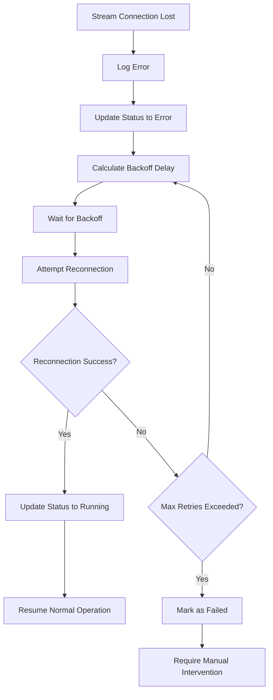
```mermaid
flowchart TD
    A[Stream Connection Lost] --> B[Log Error]
    B --> C[Update Status to Error]
    C --> D[Calculate Backoff Delay]
    D --> E[Wait for Backoff]
    E --> F[Attempt Reconnection]
    F --> G{Reconnection Success?}
    G -->|Yes| H[Update Status to Running]
    G -->|No| I{Max Retries Exceeded?}
    I -->|No| D
    I -->|Yes| J[Mark as Failed]
    H --> K[Resume Normal Operation]
    J --> L[Require Manual Intervention]
```

---

## 8. Resource Management

### 8.1 Process Lifecycle Management

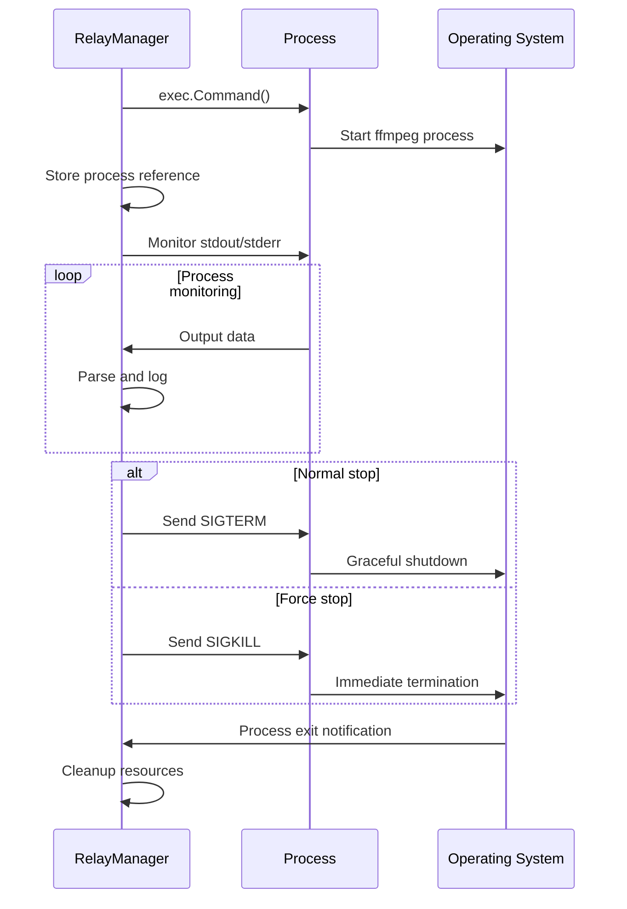
```mermaid
sequenceDiagram
    participant RM as RelayManager
    participant Proc as Process
    participant OS as Operating System

    RM->>Proc: exec.Command()
    Proc->>OS: Start ffmpeg process
    RM->>RM: Store process reference
    RM->>Proc: Monitor stdout/stderr
    
    loop Process monitoring
        Proc->>RM: Output data
        RM->>RM: Parse and log
    end
    
    alt Normal stop
        RM->>Proc: Send SIGTERM
        Proc->>OS: Graceful shutdown
    else Force stop
        RM->>Proc: Send SIGKILL
        Proc->>OS: Immediate termination
    end
    
    OS->>RM: Process exit notification
    RM->>RM: Cleanup resources
```

### 8.2 Memory and CPU Management

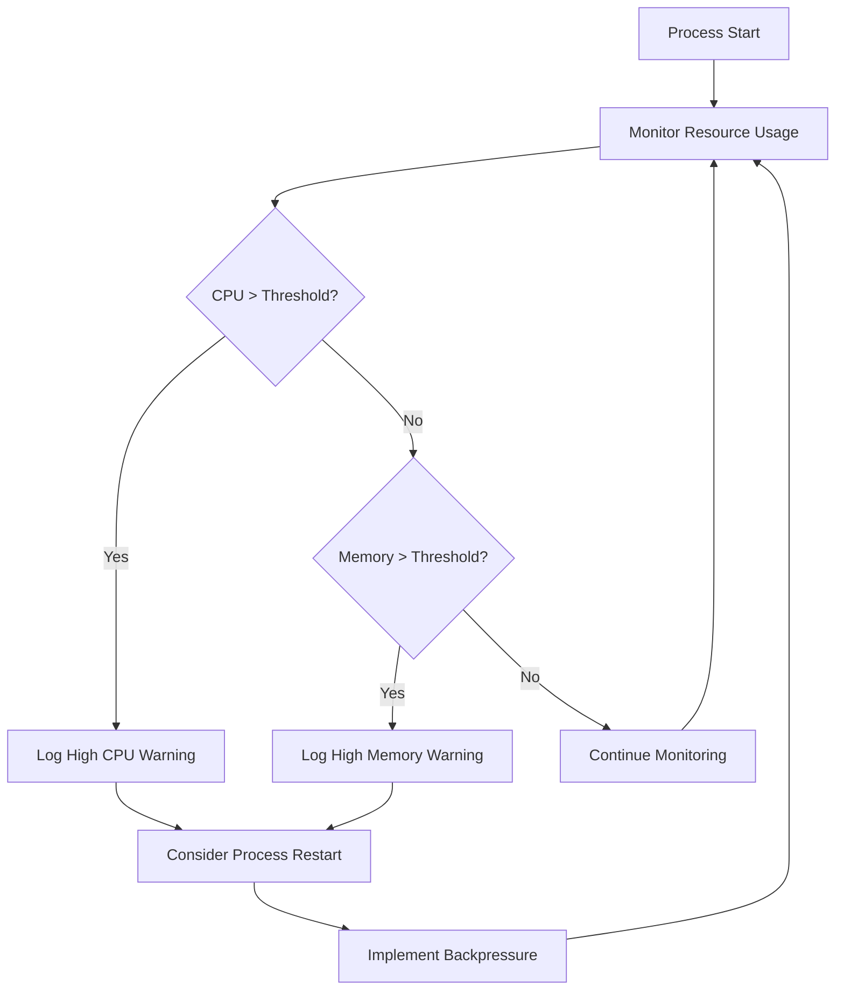
```mermaid
flowchart TD
    A[Process Start] --> B[Monitor Resource Usage]
    B --> C{CPU > Threshold?}
    C -->|Yes| D[Log High CPU Warning]
    C -->|No| E{Memory > Threshold?}
    E -->|Yes| F[Log High Memory Warning]
    E -->|No| G[Continue Monitoring]
    D --> H[Consider Process Restart]
    F --> H
    H --> I[Implement Backpressure]
    G --> B
    I --> B
```

---

## 9. Platform-Specific Optimizations

### 9.1 Preset Application Flow

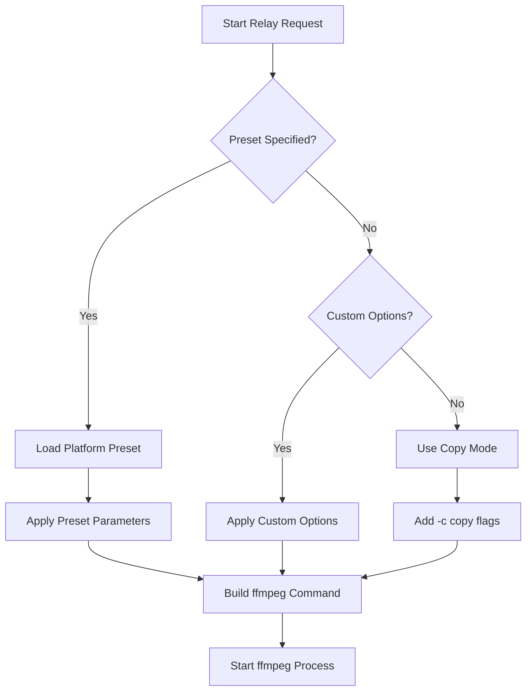
```mermaid
flowchart TD
    A[Start Relay Request] --> B{Preset Specified?}
    B -->|Yes| C[Load Platform Preset]
    B -->|No| D{Custom Options?}
    C --> E[Apply Preset Parameters]
    D -->|Yes| F[Apply Custom Options]
    D -->|No| G[Use Copy Mode]
    E --> H[Build ffmpeg Command]
    F --> H
    G --> I[Add -c copy flags]
    I --> H
    H --> J[Start ffmpeg Process]
```

### 9.2 Platform-Specific Transformations

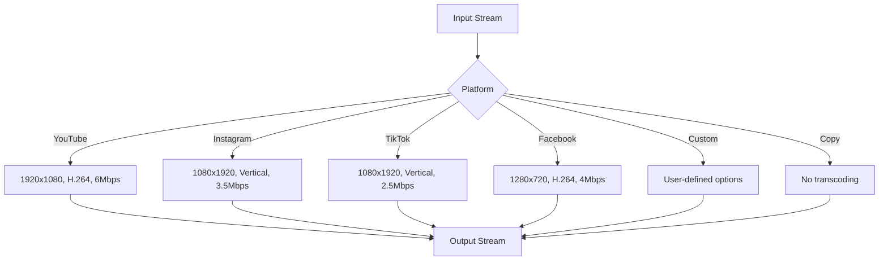
```mermaid
graph TD
    A[Input Stream] --> B{Platform}
    B -->|YouTube| C[1920x1080, H.264, 6Mbps]
    B -->|Instagram| D[1080x1920, Vertical, 3.5Mbps]
    B -->|TikTok| E[1080x1920, Vertical, 2.5Mbps]
    B -->|Facebook| F[1280x720, H.264, 4Mbps]
    B -->|Custom| G[User-defined options]
    B -->|Copy| H[No transcoding]
    
    C --> I[Output Stream]
    D --> I
    E --> I
    F --> I
    G --> I
    H --> I
```

This documentation provides a comprehensive view of how Go-MLS operates internally, showing the detailed interactions between components and the flow of data through the system.
