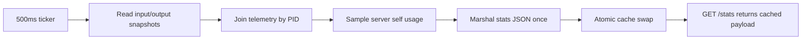

# State And Stats Guide

This guide captures practical runtime learnings for contributors and automation agents.
It explains how the in-memory state model is keyed, which operations are point updates
vs full scans, and how the `/stats` endpoint is built for low request-path overhead.

## Why This Matters

- Most write paths are keyed, single-entry updates.
- A small number of operations intentionally scan full collections.
- `/stats` is optimized to do all expensive work in a background loop, not per request.

Understanding this split helps avoid accidental regressions in race safety and latency.

## Store Data Model (Current)

The thread-safe store is in `internal/state/state.go` and currently uses:

- `inputs map[string]*Input` keyed by `stream_path`
- `outputs map[string]*Output` keyed by `stream_path/output_id`
- `recordings map[string]*Recording` keyed by `stream_path` (active recordings only)
- `hls map[string]*HLSSession` keyed by `stream_path`
- `telemetry map[int]*Telemetry` keyed by process PID

Important implication:

- There is no secondary index for outputs by stream path.
- There is no secondary index for active recordings by filename.

## Access Patterns

### High-frequency point updates (dominant)

These paths update one entity at a time and are event-driven:

- Input status, PID, and remote address updates
- Output status and PID updates
- Recording add/remove for one stream path
- Telemetry updates for one PID
- HLS viewer/session count updates for one stream path

### Full-list reads/scans (intentional, fewer)

1. Stats cache refresh reads all inputs and outputs
2. Delete input iterates outputs to remove children for one stream
3. Import reset iterates all inputs and outputs to clear runtime state
4. Export iterates all inputs and outputs to build payload
5. Recording delete checks active recordings by filename
6. Recording listing reads active recording set and merges with filesystem walk

## Frequency And Cost Profile

## Continuous background work

- Stats cache refresh loop runs every `500ms` (2 Hz)
- This is the main repeating whole-store read path

## User or automation driven work

- Delete input: low frequency, manual/admin action
- Export/import: low frequency, manual/admin action
- Delete recording: low frequency, manual/admin action

## UI-driven reads

- Web UI polls `/stats` every `3s`
- Recordings fallback polling is every `5s`
- HLS heartbeat is every `15s`

Even with frequent UI polling, request path cost remains low because `/stats` serves
precomputed cached JSON.

## Stats Pipeline Design

The API server uses a background refresher in `internal/api/server.go`:

1. Periodic goroutine wakes every `500ms`
2. Reads input/output snapshots from store
3. Enriches each item with telemetry when PID is present
4. Samples server self usage (CPU/memory)
5. Marshals full stats payload to JSON once
6. Atomically swaps cached bytes

Request path behavior for `GET /stats`:

- Reads cached bytes and writes response
- Does not rebuild stats JSON on demand
- Does not run process probing on demand

This design keeps API latency stable under polling and concurrent writes.

## Why Some Scans Still Exist

Two common questions:

1. Why does delete-input scan outputs?
2. Why does delete-recording scan active recordings by filename?

Reason:

- Current primary keys optimize ownership and mutation safety.
- Some query shapes (children-by-input and active-by-filename) need either
  filtering or a second index.

These scans are acceptable today because they are not hot request paths.

## Candidate Future Optimizations

If cardinality grows or admin operations become frequent, add secondary indexes:

- `outputsByStream map[string]map[string]*Output`
- `recordingsByFilename map[string]*Recording` for active entries

If implementing indexes, keep these invariants:

- Update all indexes under the same store lock.
- Keep one canonical object pointer per entity.
- Add race tests for add/remove/update ordering.

## Contributor And Agent Checklist

When changing state/stats behavior:

1. Confirm key shape and lookup path in store before coding.
2. Keep request handlers free of avoidable full scans in hot paths.
3. Prefer background refresh for expensive aggregate views.
4. Run race tests for touched packages.
5. Update this document and `docs/architecture.md` if behavior changes.

Suggested verification commands:

- `go test ./...`
- `go test -race ./...`
- Benchmarks for stats and state snapshots when performance-sensitive changes land.
