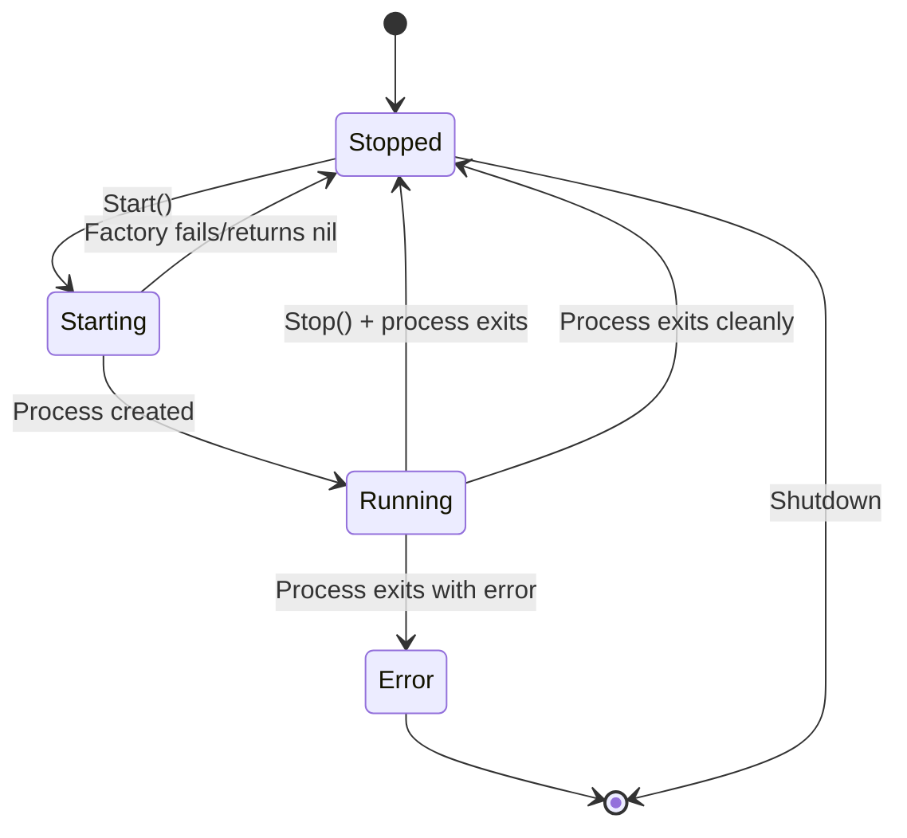

# Worker Lifecycle FSM

## Worker Interface

```go
type Worker interface {
    Start(ctx context.Context) error
    Stop()
    Wait() error
    State() WorkerState
    Done() <-chan struct{}
}
```

## Worker States

| State | Description |
|-------|-------------|
| `Stopped` | Initial state, worker not started |
| `Starting` | Worker is initializing |
| `Running` | Worker is active |
| `Stopping` | Worker is shutting down |
| `Error` | Worker encountered an error |

## BaseWorker

Provides common lifecycle management for all workers:

```go
type BaseWorker struct {
    name   string
    log    *logger.Logger
    mu     sync.RWMutex
    state  WorkerState
    stopCh chan struct{}
    doneCh chan struct{}
    exitErr error
    goroutineWG sync.WaitGroup
}
```

### Key Methods

- `Start()` - Transitions to `Starting`, resets channels, returns immediately
- `Stop()` - Non-blocking, sends signal on `stopCh`
- `Wait()` - Blocks until `doneCh` is closed
- `Done()` - Returns `doneCh` for external observation
- `State()` - Returns current state (thread-safe)
- `Shutdown()` - Calls `Stop()` then blocks on `goroutineWG`

## ProcessWorker

Extends `BaseWorker` with process management:

```go
type ProcessWorker struct {
    *BaseWorker
    procMu sync.Mutex
    proc   Process
}
```

### Process Interface

```go
type Process interface {
    PID() int
    Stop()
    Wait() error
    Done() <-chan struct{}
    Err() error
}
```

### Lifecycle

1. `RunProcessWorker()` creates worker and starts goroutine
2. Goroutine runs factory to create process
3. Process is assigned (thread-safe via `procMu`)
4. Select on `stopCh` or `proc.Done()`
5. On exit: cleanup process, call `complete()`
6. `goroutineWG.Done()` ensures cleanup before return

```go
func RunProcessWorker(ctx context.Context, name string, log *logger.Logger, factory ProcessFactory) (*ProcessWorker, error) {
    w := NewProcessWorker(name, log)
    if err := w.Start(); err != nil {
        return nil, err
    }
    w.startProcessLoop(ctx, factory)
    return w, nil
}
```

## Typed Errors

Located in `internal/worker/process_errors.go`:

```go
var (
    ErrProcessFailed = errors.New("process failed")
    ErrProcessKilled = errors.New("process killed")
)
```

### Helper Functions

- `IsProcessKilled(err)` - Checks if error is from SIGKILL/SIGTERM
- `IsProcessFailed(err)` - Checks if process exited with non-zero code
- `GetExitCode(err)` - Returns exit code from `*exec.ExitError`
- `IsSignaled(err)` - Checks if process was killed by signal
- `NormalizeError(err)` - Converts raw errors to typed errors

## State Diagram



Note: The `Stopping` state is an implementation detail and never observable. State transitions happen atomically via `complete()`.

## Shutdown Order

For graceful shutdown, components must stop in order:

1. **HTTP Server** - Stop accepting new requests
2. **Workers** - Call `Shutdown()` on each worker
3. **App Context** - Stop Hub, Ingest, HLSManager

```go
// Shutdown sequence
server.Shutdown()       // 1. HTTP server
appCtx.Shutdown()       // 2. Stops Hub, Ingest, HLSManager
<-ctx.Done()            // 3. Wait for context cancellation
```

## Data Race Prevention

The `ProcessWorker` uses `procMu` mutex to protect the `proc` field:

- `Stop()` locks before checking `w.proc`
- Factory goroutine locks before setting `w.proc`
- `Stop()` clears `w.proc` under lock before calling `proc.Stop()`
- Prevents races between `Stop()` and goroutine assignment
- Prevents double-stop panics when multiple goroutines call `Stop()` concurrently
