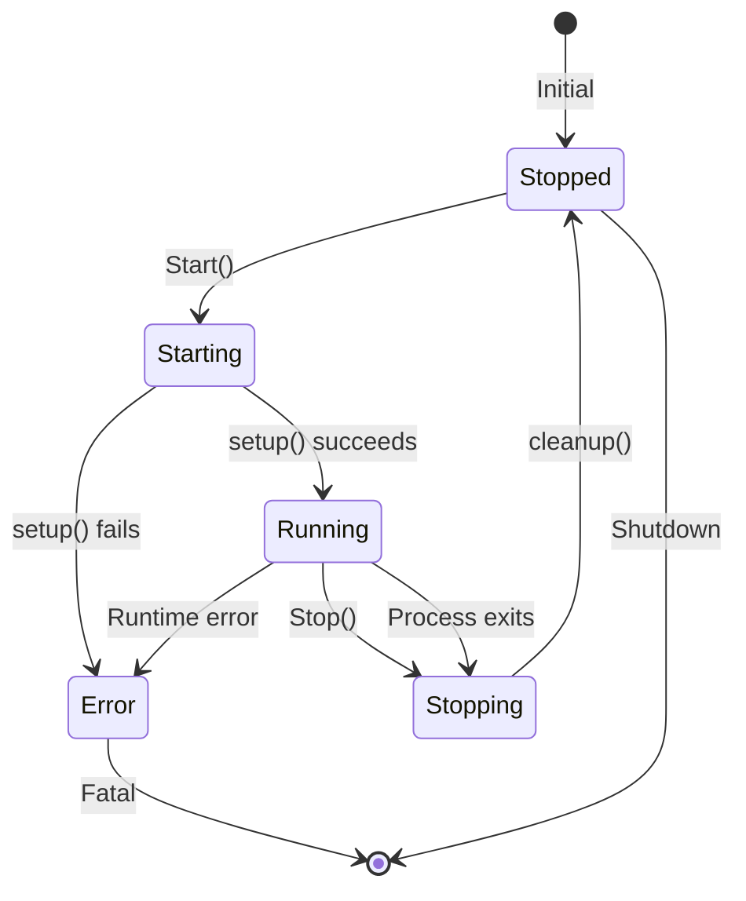
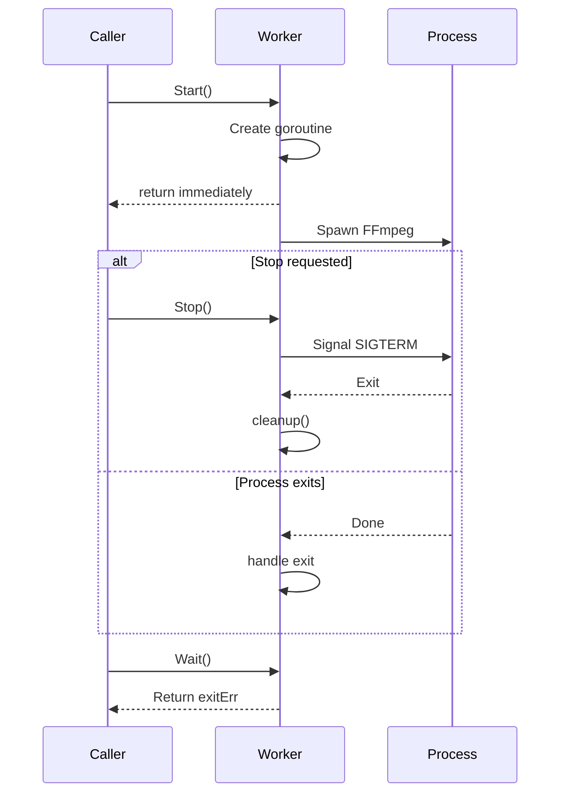

# Worker Lifecycle FSM Design

## Problem Statement

The codebase had two parallel architectures with inconsistent goroutine lifecycle management:

1. **Stream Package** (`internal/stream/`): Uses `sync.WaitGroup` for goroutine tracking
2. **Worker Package** (`internal/worker/`): No goroutine tracking, fire-and-forget `Stop()`

This led to:
- Goroutine leaks on shutdown
- Races between `Stop()` and `Wait()` (channel consumption deadlock)
- Inconsistent behavior across worker types
- Duplicate FFmpeg process implementations

## Implemented Solution

### Base Worker Pattern

```go
// Worker defines the interface for all workers
type Worker interface {
    Start(ctx context.Context) error
    Stop()
    Wait() error
    State() WorkerState
    Done() <-chan struct{}
}

// BaseWorker provides common lifecycle management
type BaseWorker struct {
    name   string
    log    *logger.Logger
    mu     sync.RWMutex
    state  WorkerState
    stopCh chan struct{}
    doneCh chan struct{}
    exitErr error
    goroutineWG sync.WaitGroup
}
```

### Key Design Principles

1. **Single exit path**: All workers signal completion via `doneCh`
2. **Stop() signals, doesn't wait**: `Stop()` only triggers shutdown, `Wait()` blocks for completion
3. **Process ownership**: FFmpegProcess owns its goroutines; Stop() triggers context cancellation only
4. **Atomic state transitions**: State changes protected by mutex
5. **No channel races**: Only ONE goroutine reads from process exit channels

### State Machine



### Lifecycle Flow



## Files Changed

### New Files
- `internal/worker/worker.go`: Base worker types and ProcessWorker pattern

### Modified Files
- `internal/worker/ffmpeg.go`: Fixed `Stop()` - no longer waits on `done` channel
- `internal/worker/puller.go`: Uses ProcessWorker pattern
- `internal/worker/restreamer.go`: Uses ProcessWorker pattern
- `internal/worker/recorder.go`: Uses ProcessWorker pattern
- `internal/worker/hls.go`: Removed redundant context cancel, fixed session cleanup

### Fixed in Stream Package
- `internal/stream/ffmpeg_process.go`: Fixed `Stop()` deadlock (doesn't consume waitCh)
- `internal/stream/stream.go`: Added `Proc` field to `PipelineRecording`
- `internal/stream/pipeline.go`: Fixed `StopRecording` and `StopHLS` to actually stop processes

## Anti-Patterns Fixed

### ❌ Before: Stop() waited on done channel (deadlock)
```go
func (fp *FFmpegProcess) Stop() {
    fp.cancel()
    <-fp.done  // DEADLOCK if monitor goroutine also waits!
}
```

### ✅ After: Stop() only signals, Wait() blocks
```go
func (fp *FFmpegProcess) Stop() {
    fp.cancel()  // Signal only
}

func (fp *FFmpegProcess) Wait() error {
    <-fp.done  // Caller decides when to wait
    fp.store.RemoveTelemetry(fp.pid)
    return fp.Err()
}
```

## Remaining Work

1. **Unify two FFmpegProcess implementations** - Both packages keep their own FFmpegProcess implementation due to different feature sets:
   - `internal/worker/ffmpeg.go` - Integrates with state.Store for telemetry, uses gopsutil
   - `internal/stream/ffmpeg_process.go` - Has ProcessHandle abstraction, tracks output history

2. **Add tests for new worker patterns** - ✅ Completed: `internal/worker/worker_test.go`

3. **Consider embedding Worker interface in Pipeline workers** - ✅ Completed: `Pipeline` uses goroutineWG tracking, `Worker` interface in worker package for state-based architecture

### Completed Items

- ✅ Worker state machine with Error state
- ✅ BaseWorker and ProcessWorker types
- ✅ Process interface for FFmpeg process abstraction
- ✅ ProcessCreator interface for factory pattern
- ✅ Comprehensive unit tests for worker patterns
- ✅ Fixed channel consumption deadlock in Stop/Wait pattern
